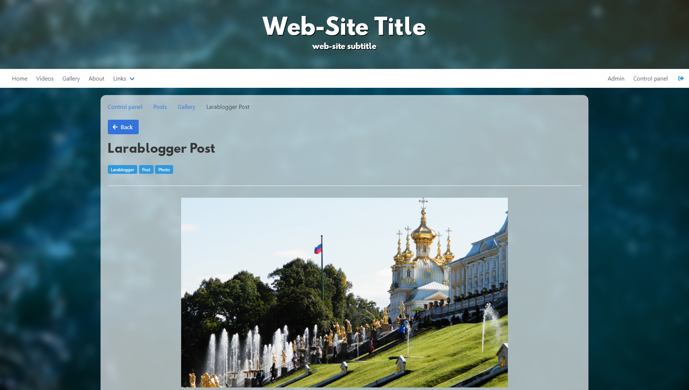
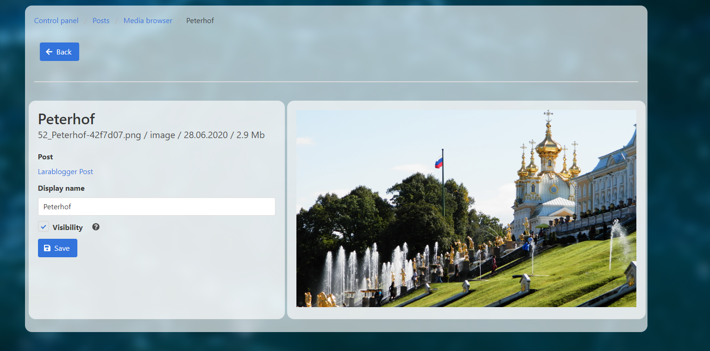
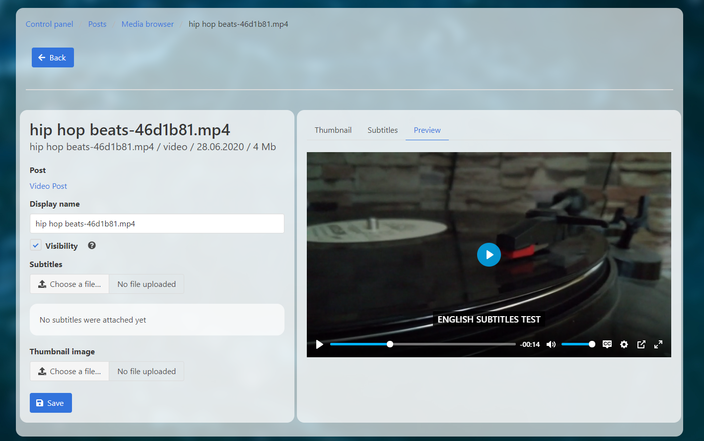

    
    <h3>A Laravel based CMS for blogging</h3>

    <h3>What is this?</h3>
    
<b>Larablogger</b> is a CMS based on PHP framework Laravel for creating and maintaining personal blogs. The key feature is easy to use file uploader and media browser that allows you to share videos and photos on your personal wen-

    

    <h3>Key features</h3>
    <ul>
        <li>Post managment system. You can show or hide posts, pin or unpin posts.</li>
        <li>Advanced media managment system. You can attach videos and photos to your blog posts. You can set thumbnails and upload subtitles to your videos (just like on YouTube).</li>
        <li>You can manage categories and change design of your site.</li>
        <li>Feedback system.</li>
    </ul>
    
The list of features will expand as the development goes on.

    <h3>Installation</h3>

To run the CMS on your local machine do the following steps <i>(you will need PHP 7.2 or above and MySQL or any other DBMS supported by Laravel installed on your computer)</i>.

<ol>
    <li>Create the ".env" file using the ".env.example" in the root folder.</li>
    <li>Create an empty database in your preferred DBMS (in our case that would be "videoblog" database in MySQL) and write a connection in your ".env" file like this</li>
    <blockquote>
        
DB_CONNECTION=mysql

        
DB_HOST=127.0.0.1
   
        
DB_PORT=3306

        
DB_DATABASE=videoblog

        
DB_USERNAME=*database_username*

        
DB_PASSWORD=*database_password*

    </blockquote>
        <li> Open <i>AppServiceProvider.php</i> file that is in <i>app/Providers</i> folder and uncomment the boot function.</li>
        <li>Install <a href="https://getcomposer.org/" target="_blank">Composer</a> and run <i>"composer update"</i> command in your project derictory. That will install all of the project dependencies.</li>
    <li>Run <i>"php artisan migrate"</i> command, that will fill your database with tables and predefined data.</li>
    <li>Run <i>"php artisan storage:link"</i> command, that will enable the file storage for your web-site.</li>
    <li>Run <i>"php artisan key:generate"</i> command, that will generate the encryption key for your web-site.</li>
    <li>Run <i>"php artisan config:cache"</i> command, to clear cache (sometimes the encryption key won't be recognized until you clear the cache) .</li>
    <li>Run <i>"php artisan serve"</i> to start the server on your local machine.</li>
    <li>Open <i>"127.0.0.1/register"</i> url in your browser and register a user. The very first registered user gets Super Admin rights.</li>
</ol>

To run the CMS on a hosting or a dedicated server you need to do these steps.

<ol>
    <li>Upload the project to the root folder of your web-site.</li>
    <li>Repeat the steps 1-7 from the instruction above.</li>
    <li>If your index folder is public_html, follow steps in <a href="https://stackoverflow.com/questions/30198669/how-to-change-public-folder-to-public-html-in-laravel-5" traget="_blank">this instruction</a> to change the index folder from public to public_html.</li>
    <li>Register a user through <i>"your-web-site.com/register"</i> url to create a Super Admin user.</li>
</ol>

    <h3>Feedback system</h3>
    
To enable the <b>Feedback system</b> follow these steps.

    <ol>
        <li>Open the control panel on your web-site and set up "Contact e-mail" and "Sender e-mail" field in Settings. "Contact e-mail" is an e-mail that feedback messages will be sent to. "Sender e-mail" is an e-mail that will be used as a sender.</li>
        <li>Open the ".env" file and add info about your smtp server like this.</li>
        <blockquote>
            
MAIL_MAILER=smtp

            
MAIL_HOST=smtp.my-email-server.com

            
MAIL_PORT=2525

            
MAIL_USERNAME=my-sender-email@mail.com

            
MAIL_PASSWORD=my-sender-email-password

            
MAIL_ENCRYPTION=tls

        </blockquote>
        <li>Use <i>"php artisan config:cache"</i> command in case the config doesn't update.</li>
    </ol>

    
    

    <h3>Libraries used in development of this project</h3>
    <ul>
        <li><a href="https://laravel.com/" target="_blank">Laravel</a></li>
        <li><a href="https://bulma.io/" target="_blank">Bulma</a></li>
        <li><a href="https://github.com/vyachkonovalov/bulma-tagsfield" target="_blank">Bulma Tags Field</a></li>
        <li><a href="https://www.dropzonejs.com/" target="_blank">Dropzone.JS</a></li>
        <li><a href="https://github.com/webfashionist/RichText" target="_blank">jQuery RichText</a></li>
        <li><a href="https://plyr.io/" target="_blank">Plyr</a></li>
    </ul>

    
This project is free to use.

